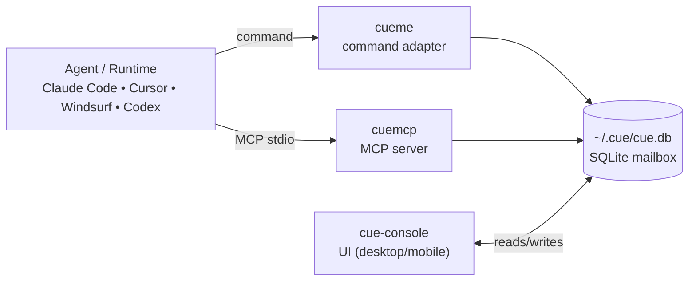

# CueStack

<div align="center">

<strong><a href="./README.md">English</a></strong>
 ·
<strong><a href="./README.zh-CN.md">中文</a></strong>

</div>

---

<div align="center">

[](https://github.com/nmhjklnm/cue-stack)
[](https://github.com/nmhjklnm/cue-console)
[](https://github.com/nmhjklnm/cue-command)
[](https://github.com/nmhjklnm/cue-mcp)
[](./LICENSE)
[](https://github.com/nmhjklnm/cue-console/actions/workflows/publish.yml)
[](https://github.com/nmhjklnm/cue-command/actions/workflows/publish.yml)
[](https://github.com/nmhjklnm/cue-mcp/actions/workflows/publish.yml)
[](https://www.npmjs.com/package/cue-console)
[](https://www.npmjs.com/package/cue-console)
[](https://www.npmjs.com/package/cueme)
[](https://www.npmjs.com/package/cueme)
[](https://pypi.org/project/cuemcp/)
[](https://pypi.org/project/cuemcp/)
[](https://pypi.org/project/cuemcp/)

</div>

[Contributing](./CONTRIBUTING.md) · [Trademark](./TRADEMARK.md)

| Mobile | Desktop |
| --- | --- |
|  |  |

Treat your agent as a collaborator.

Open the console.

Agents can run for hours. At that point they stop feeling like “tools” and start feeling like “coworkers”.
Coworkers don’t dump their entire context on you — they bring progress, questions, and decisions. HAP defines that contract; `cue-command` implements it.

| Repo | What it is | Link |
| --- | --- | --- |
| `cue-console` | UI inbox (desktop + mobile) | [github.com/nmhjklnm/cue-console](https://github.com/nmhjklnm/cue-console) |
| `cue-command` | HAP command adapter (`cueme`) | [github.com/nmhjklnm/cue-command](https://github.com/nmhjklnm/cue-command) |
| `cue-mcp` | HAP implementation (MCP server) | [github.com/nmhjklnm/cue-mcp](https://github.com/nmhjklnm/cue-mcp) |

---

## Start here (copy/paste runway)

### 1) Install packages & start UI

```bash
npm install -g cue-console
npm install -g cueme
cue-console start
```

Open `http://localhost:3000`.

### 2) Configure system prompt

Use `cueme proto` to inject `protocol.md` into your runtime's persistent rules.

Example (macOS + Windsurf):

```bash
cueme proto apply windsurf
```

Reference:

- [`cue-command/protocol.md`](https://github.com/nmhjklnm/cue-command/blob/main/protocol.md)
- `cueme proto` docs: `cue-command/docs/proto.md`

### 3) Start the first chat in your IDE, then continue in cue-console

In your IDE chat panel, send the text:

`cue`

Then continue follow-up conversation rounds in cue-console (`http://localhost:3000`).

<details>
<summary>Optional: MCP server (cuemcp)</summary>

Recommended runtime command:

- `command`: `uvx`
- `args`: `--from cuemcp cuemcp`

Claude Code:

```bash
claude mcp add --transport stdio cuemcp -- uvx --from cuemcp cuemcp
```

<details>
<summary>Other runtimes (Windsurf / Cursor / Codex / VS Code)</summary>

Windsurf (`~/.codeium/mcp_config.json`):

```json
{
  "mcpServers": {
    "cuemcp": {
      "command": "uvx",
      "args": ["--from", "cuemcp", "cuemcp"]
    }
  }
}
```

Cursor (`mcp.json` in your project):

```json
{
  "mcpServers": {
    "cuemcp": {
      "command": "uvx",
      "args": ["--from", "cuemcp", "cuemcp"],
      "env": {}
    }
  }
}
```

Codex:

```bash
codex mcp add cuemcp -- uvx --from cuemcp cuemcp
```

VS Code:

```json
{
  "servers": {
    "cuemcp": {
      "type": "stdio",
      "command": "uvx",
      "args": ["--from", "cuemcp", "cuemcp"]
    }
  }
}
```

</details>

### If it doesn’t work (30-second checklist)

- `cue-console` is running and you opened `http://localhost:3000`
- If you're using cuemcp: `uvx` is available (`uv` installed) and your runtime can launch the MCP server
- Both sides can access the same mailbox DB: `~/.cue/cue.db`
- Your runtime has the HAP rule injected (so it calls `cue()` before ending and waits for you)

</details>

---

<details>
<summary>Architecture (at a glance)</summary>

```text
Agent/Runtime  ⇄  (cueme OR cuemcp)  ⇄  ~/.cue/cue.db  ⇄  cue-console
```



</details>

---

## QQ Group


