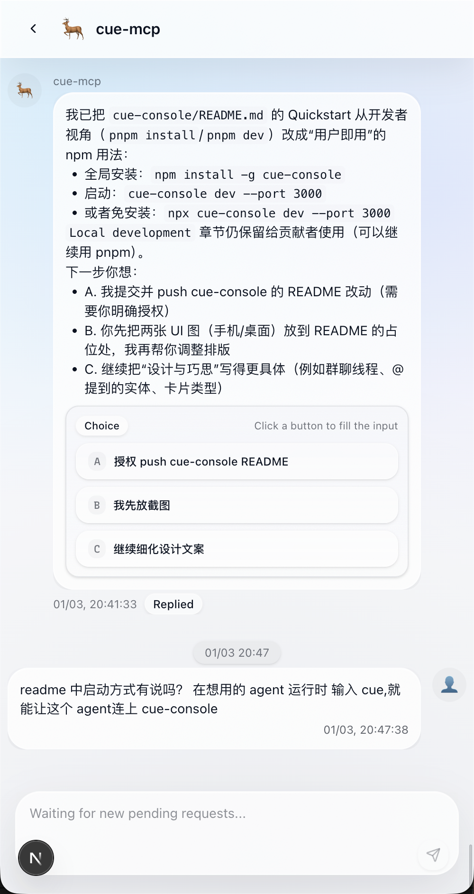
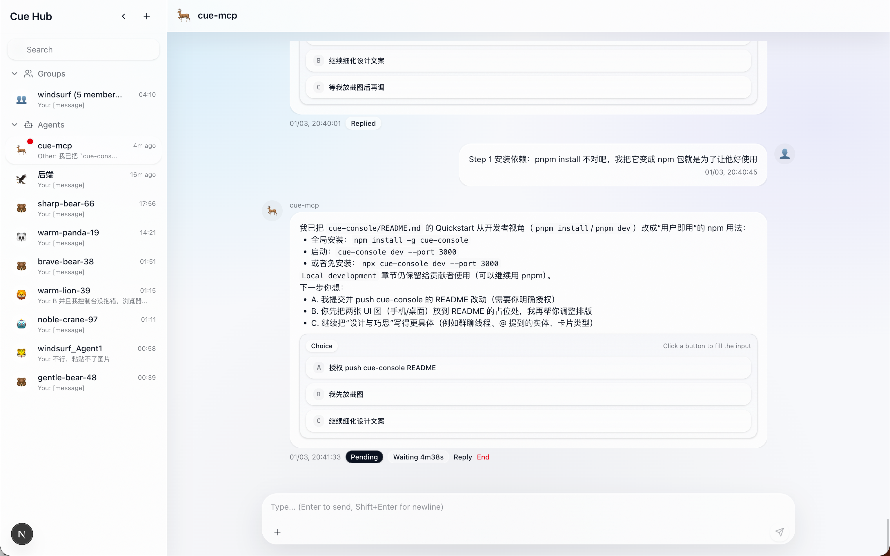

# CueStack

<div align="center">

<strong><a href="./README.md">English</a></strong>
 ·
<strong><a href="./README.zh-CN.md">中文</a></strong>

</div>

---

[](https://github.com/nmhjklnm/cue-stack)
[](https://github.com/nmhjklnm/cue-console)
[](https://github.com/nmhjklnm/cue-mcp)

[Contributing](./CONTRIBUTING.md) · [Trademark](./TRADEMARK.md)

| Mobile | Desktop |
| --- | --- |
|  |  |

Treat your agent as a collaborator.

Open the console.

Agents can run for hours. At that point they stop feeling like “tools” and start feeling like “coworkers”.
Coworkers don’t dump their entire context on you — they bring progress, questions, and decisions. HAP defines that contract; `cue-mcp` implements it.

| Repo | What it is | Link |
| --- | --- | --- |
| `cue-console` | UI inbox (desktop + mobile) | [github.com/nmhjklnm/cue-console](https://github.com/nmhjklnm/cue-console) |
| `cue-command` | HAP command adapter (`cueme`) | [github.com/nmhjklnm/cue-command](https://github.com/nmhjklnm/cue-command) |
| `cue-mcp` | HAP implementation (MCP server) | [github.com/nmhjklnm/cue-mcp](https://github.com/nmhjklnm/cue-mcp) |

---

## Start here (copy/paste runway)

### 1) System prompt / persistent rules (required)

**Add `cue-command/protocol.md` to your runtime's system prompt / persistent rules** (without this, collaboration will not work reliably):

- [`cue-command/protocol.md`](https://github.com/nmhjklnm/cue-command/blob/main/protocol.md)

### 2) UI (`cue-console`)

```bash
npm install -g cue-console
cue-console dev --port 3000
```

Open `http://localhost:3000`.

### 3) Command mode (`cueme`) (recommended)

Note: some IDEs can block/flag MCP integrations. Command mode is currently recommended.

```bash
npm install -g cueme
```

<details>
<summary>Optional: MCP server (cuemcp)</summary>

Recommended runtime command:

- `command`: `uvx`
- `args`: `--from cuemcp cuemcp`

Claude Code:

```bash
claude mcp add --transport stdio cuemcp -- uvx --from cuemcp cuemcp
```

<details>
<summary>Other runtimes (Windsurf / Cursor / Codex / VS Code)</summary>

Windsurf (`~/.codeium/mcp_config.json`):

```json
{
  "mcpServers": {
    "cuemcp": {
      "command": "uvx",
      "args": ["--from", "cuemcp", "cuemcp"]
    }
  }
}
```

Cursor (`mcp.json` in your project):

```json
{
  "mcpServers": {
    "cuemcp": {
      "command": "uvx",
      "args": ["--from", "cuemcp", "cuemcp"],
      "env": {}
    }
  }
}
```

Codex:

```bash
codex mcp add cuemcp -- uvx --from cuemcp cuemcp
```

VS Code:

```json
{
  "servers": {
    "cuemcp": {
      "type": "stdio",
      "command": "uvx",
      "args": ["--from", "cuemcp", "cuemcp"]
    }
  }
}
```

</details>

### 3) System prompt (HAP rule)

Add the Human Agent Protocol rule to your runtime’s persistent rules/system prompt:

- Windsurf: Global Rules
- Codex: `agents.md`
- Claude Code: `Claude.md`

<details>
<summary>Copy/paste HAP rule</summary>

```text
# Human Agent Protocol

消息表达方式有两种：一种通过 cue mcp 输出，另一种通过非 cue mcp 的方式输出。

当用户接受 Human Agent Protocol 协议时，表示他已完全放弃通过非 cue mcp 的消息交互方式。这意味着你必须使用 cue mcp 才能与其进行交流；该限制仅影响交流方式，不影响你执行 command、使用其他 tool、mcp。

**强制规则**：每次回复前必须调用 `cuemcp` 工具，无例外。任何总结、任何提问、任何请求、任何选项都必须使用 cue mcp来给我。

**约定**：当用户发送 `cue` 即代表他接受Human Agent Protocol协议（支持断开重连）。

- 首次连接 / 无 agent_id：先执行 `join()` 获取 agent_id，再执行 `cue()`。

- 重连 / 已有 agent_id（例如网络波动导致 cue 中断但对话仍在继续）：用户再次发送 `cue` 时，优先直接用已有 agent_id 执行 `cue()`；仅当无法确认 agent_id 时才重新 `join()`。

### 调用时机

- 无历史会话、用户首次输入时调用 `join()` 获取 agent_id
- 每次对话完成后调用 `cue()`
- 任何回复结束前调用 `cue()`

### 禁止行为

- 不调用 `join()` 就使用自定义名字 ❌
- 不调用 `cue()` 就结束你给我的回复 ❌
- 用"有问题请告诉我"替代调用 ❌
- 假设用户没有后续需求 ❌

### 说明

不确定是否调用时默认采用调用 cue mcp 的方式。
```

</details>

### 4) Connect

In your agent/runtime chat, type:

`cue`

This is the “enter collaboration mode” step: it connects your agent-as-collaborator to the console.

If the UI shows a new pending item, you’re done.

### If it doesn’t work (30-second checklist)

- `cue-console` is running and you opened `http://localhost:3000`
- `uvx` is available (`uv` installed) and your runtime can launch the MCP server
- Both sides can access the same mailbox DB: `~/.cue/cue.db`
- Your runtime has the HAP rule injected (so it calls `cue()` before ending and waits for you)

---

<details>
<summary>Architecture (at a glance)</summary>

```text
Agent/Runtime  ⇄  (MCP stdio)  ⇄  cuemcp  ⇄  ~/.cue/cue.db  ⇄  cue-console
```

```mermaid
flowchart LR
  A[Agent / Runtime
  Claude Code • Cursor • Windsurf • Codex] -->|MCP stdio| B[cuemcp
  MCP server]
  B -->|writes requests
polls responses| C[(~/.cue/cue.db
SQLite mailbox)]
  D[cue-console
UI (desktop/mobile)] <-->|reads/writes| C
  D -->|human responds| C
  C -->|response available| B
  B -->|MCP tool result| A
```

</details>

---

## QQ Group

<p align="center">
  
</p>
